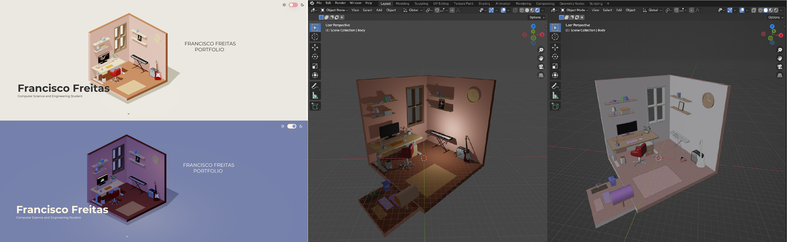

# 🌐 FranciscoJRFreitasWebsite  

Welcome to my **personal interactive portfolio**! 🚀  

🔗 **[Visit my personal webpage](https://franciscofreitas.netlify.app)**  

This portfolio is an interactive experience that visually represents my workspace using a **3D model of my room**, built with **Three.js** and **Blender**. As you scroll, different sections are revealed, highlighting my **projects, skills, experiences, and interests**.  

## 🎨 Overview  
This project is designed to provide an engaging and immersive way to explore my work. The combination of 3D graphics, smooth animations, and a clean UI creates a unique way to navigate through my personal and professional background.  

## 🛠️ Technologies Used  
- **Three.js** – To render and manage the interactive 3D environment.  
- **Blender** – For designing and modeling my virtual room.  
- **HTML, CSS, JavaScript** – For building the website structure and interactions.  
- **GSAP (GreenSock)** – To create smooth scrolling animations.  

## 🌟 Features  
🔹 **Interactive 3D Model** – A digital version of my workspace, built from scratch.  
🔹 **Scroll-Based Navigation** – Information appears dynamically as you scroll.  
🔹 **Dark/Light Mode Toggle** – Adaptive aesthetics for a better viewing experience.  
🔹 **Projects & Experience Showcase** – An engaging way to highlight my work.  
🔹 **Fully Responsive** – Optimized for desktop and mobile viewing.  

## 📜 Website Sections  
1. **Introduction** – Who I am and what I do.  
2. **My Interests** – My hobbies, passions, and inspirations.  
3. **Projects & Experience** – Showcasing my key work and skills.  
4. **Contact** – Ways to reach me.  

## 📸 Preview  
  

## 🚀 How to Run Locally  
If you want to run the project locally, follow these steps:  

1. Clone this repository:  
   ```sh
   git clone https://github.com/FranciscoJRFreitas/interactive-portfolio.git
   ```
2. Navigate to the project directory:  
   ```sh
   cd interactive-portfolio
   ```
3. Open `index.html` in your browser or start a local server:  
   ```sh
   npx http-server
   ```
   Then open `http://localhost:8080` in your browser.  

## 📬 Contact  
📧 Email: franfreitas2002@gmail.com  
🌐 Portfolio: [franciscofreitas.netlify.app](https://franciscofreitas.netlify.app)  
👨‍💻 LinkedIn: [Francisco Freitas](https://linkedin.com/in/franciscofreitas)  
